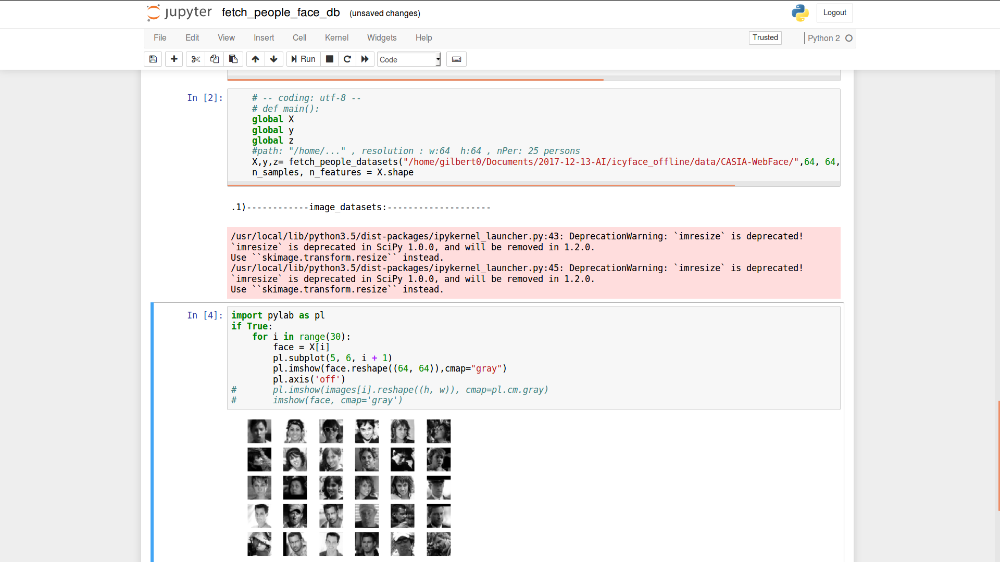

# import_sklearn_imgDB

Import dataset from your img DB to convert to sklearn format

For AI need 要把LFW/CASIA/MS CELEB 1M資料庫讀進來，花了很多時間在研究，下面是我在github的成果
我自己寫的可以讀出所有img data set符合sklearn/keras 深度學習套件所需之格式
即格式為ndarray，由data和target和name 共三部分组成的
之後只要輸入四個參數 即
* folder name, # CASIA/MS_CELEB_1Million
* w = 64 , #寬
* h = 64 ,#高
* nPer = 1200 #人

## fetch_people_face_db.py

    Read img建立 initial img data base

## sklearn_data.py

    Let img data convert to sklearn img DB 可以使用的模式，即格式为ndarry，由data和target和name 3部分组成的数据

## casia_part folder
    Extracted some file from CASIA face img datasets

## Demo image

## Ref
#### 1).tensorflow/tflearn import imgDB  method
https://mrlittlepig.github.io/2017/04/30/tensorflow-for-image-processing/
#### 2).keras/sklearn  import imgDB  method
http://blog.csdn.net/nanbei2463776506/article/details/63253467
